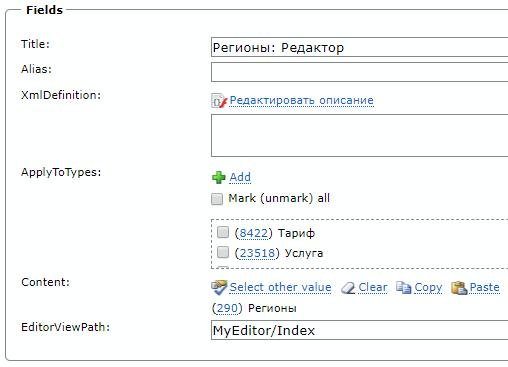
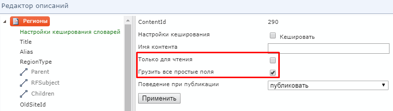
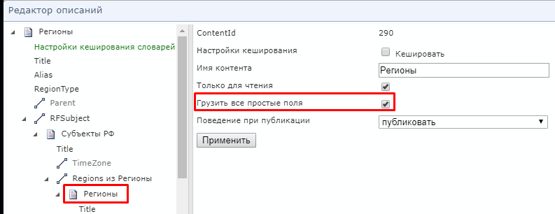
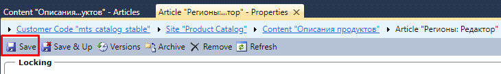

<aside style="position: fixed; right: 10px">

* [Точка входа](#Точка%20входа)
* [Описания продуктов](#Описания%20продуктов)
* [Схема TypeScript](#Схема%20TypeScript)

</aside>
<main style="width: 900px">

# Создание редактора DPC

## Точка входа

1.  В каталог `~\Views\ProductEditor` создаем новый каталог с именем нашего редактора `MyEditor`.

2.  В новом каталоге создаем два файла, например
    `Index.cshtml` и `Index.jsx`, или `MyEditor.cshtml` и `MyEditor.tsx`.

**MyEditor\Index.cshtml**

```html
@model QA.ProductCatalog.Admin.WebApp.Models.ProductEditorSettingsModel
@{ Layout = null; }
<!DOCTYPE html>
<html>
<head root-url="@Url.Content("~")">
  <meta charset="utf-8" />
  <meta http-equiv="X-UA-Compatible" content="IE=Edge" />
  <title>@(ViewBag.Title ?? "DPC")</title>
  <style type="text/css">
    html {
      background-color: #f5f8fa;
    }
  </style>
  <script src="https://cdn.polyfill.io/v2/polyfill.min.js?features=es6,fetch,Array.prototype.includes,Object.values,Object.entries"></script>
  @Model.SerializeSettings()
</head>
<body>
  <div id="editor"></div>
  <script src="~/Scripts/Bundles/ProductEditor/MyEditor/Index.js"></script>
</body>
</html>
```

**MyEditor\Index.tsx**

```jsx
import "Environment"; // Импортируем базовые стили и код (обязательно)
import React from "react";
import ReactDOM from "react-dom";

const App = () => null;

ReactDOM.render(<App />, document.getElementById("editor"));
```

<br>

## Описания продуктов

1.  Создаем новую статью в контенте `ProductDefinitions` (Описания продуктов)


2.  Заполняем следующие поля:

* `Title` — Название.
* `Content` — Контент, статьи которого мы будем редактировать.
* `ApplyToTypes` — Типы продуктов (заполняем, если сделать редактор только для конкретных типов продукта).
* `EditorViewPath` — Путь к созданной точке входа относительно `~\Views\ProductEditor`. Пример: `MyEditor\Index`.
* `XmlDefinition` — XML Описание (заполняем в отдельном окне)



3.  Настраиваем определение для контента:

* `Только для чтения` — Использовать выбранный контент только для чтения. Каждый контент одного и того же типа (см. поле-классификатор `Type`) может быть включен в определение продукта сколько угодно раз с флагом `Только для чтения`, но только один раз без него (для редактирования).
* `Грузить все простые поля` — Отображать в редакторе все простые поля (не связи) из QP, даже если они явно не включены в XML-описание.



4.  Добавляем простые поля:

* `Включить в описание`
* `Имя поля` — Название поля в JSON (переопреледяет данные из QP).
* `Имя поля для карточки` — Label для поля в редакторе (переопреледяет данные из QP).


5.  Добавляем поля-связи:

* `При клонировании родительской сущности` **CloningMode** — Что делать со cвязью, когда клонируется родительская статья.
* `При удалении родительской сущности или удалении связи` **DeletingMode** — Удалять )архивировать) ли статьи-связи вместе с родительской статьей
* `При создании\обновлении` **UpdatingMode** — Применять ли изменения в статьях-связях при сохранении изменений родительской статьи.
* `PreloadingMode` — Загружать ли все возможные значения поля-связи заранее. Возможные варианты:
  * `не загружать` **PreloadingMode.None** — Всегда выбирать статьи-связи в диалоговом окне QP
  * `загружать сразу` **PreloadingMode.Eager** — Заранее загрузить все возможные статьи связи для данного поля. Это позволит выбирать значения поля-связи из комбо-бокса или списка чекбоксов, без открытия QP.
  * `загружать отложенно` **PreloadingMode.Lazy** — Загрузить все возможные статьи связи для данного поля только при первом отображении этого поля в редакторе. Это позволит выбирать значения поля-связи из комбо-бокса или списка чекбоксов, без открытия QP.
* `RelationCondition` — SQL-фильтр для выбора допустимых статей поля-связи. Подставляется в блок `WHERE` при фильтрации статей в диалоговом окне QP или при предзагрузке допустимых статей-связей. Фильтруемый контент обозначается алиасом `c`. Пример: `c.Type = 343` (Тарифы). Если поле не заполнено, то его значение берется из `RelationCondition` в QP.
* `ClonePrototypeCondition` — SQL-условие для выбора единственной статьи-шаблона, которая используется для создания статьи-связи по образцу контент обозначается алиасом `c`. Пример: `c.Alias = 'my_region_template'`. Если поле не заполнено, то создание по обрацу будет недоступно.


6.  Добавляем обратные поля-связи:

То же самое, что и для связей, но необходимо явно переопределить `Имя поля`, т.к. BackwardRelation отсутствует в QP. В примере ниже, статья `Region` будет иметь поле `TariffZones`, содержащее массив статей `TariffZone`


Так же можно добавить обратное поле-связь для уже включенного в описание прямого поля. Но при этом, контент, который содержится в обратном поле обязательно должен иметь флаг `Только для чтения`.




7.  Добавляем поля-классификаторы:

Выбираем допустимые контенты-расширения для данного поля (вручную редактируя XML).


8.  Повторяем п. 1 — п.7 для всех необходимых связей продукта.

9.  Настраиваем кеширование:

Добавляем поле `Настройки кеширования словарей` и включем туда контенты-справочники, которые редко изменяются (и которые не редактируются в нашем редакторе)


10. Сохраняем сначала изменения в XML, а потом статью с описанием продукта:




<br>

## Схема TypeScript

TODO:

</main>
