<aside style="position: fixed; right: 10px">

* [Точка входа](#Точка-входа)
  * [CustomAction](#CustomAction)
* [XML Описания продуктов](#XML-Описания-продуктов)
  * [Создание статьи](#Создание-статьи)
  * [Настройка контентов](#Настройка-контентов)
  * [Простые поля](#Простые-поля)
  * [Поля-связи](#Поля-связи)
  * [Поля-расширения](#Поля-расширения)
  * [Кеширование](#Кеширование)
  * [XAML-ссылки](#XAML-ссылки)
* [Схема TypeScript](#Схема-TypeScript)
* [Инициализация редактора](#Инициализация-редактора)
* [Модель данных](#Модель-данных)
  * [Данные](#Данные)
    * [Статьи-расширения](#Статьи-расширения)
    * [Предыдущие значения полей](#Предыдущие-значения-полей)
    * [DataContext](#DataContext)
  * [Схема](#Схема)

</aside>
<main style="width: 900px">

# Создание редактора DPC

## Точка входа

1.  В каталог `~\Views\ProductEditor` создаем новый каталог с именем нашего редактора `MyEditor`.

2.  В новом каталоге создаем два файла, например `Index.cshtml` и `Index.jsx`, или `MyEditor.cshtml` и `MyEditor.tsx`.

**MyEditor\Index.cshtml**

```html
@model QA.ProductCatalog.Admin.WebApp.Models.ProductEditorSettingsModel
@{ Layout = null; }
<!DOCTYPE html>
<html>
<head root-url="@Url.Content("~")">
  <meta charset="utf-8" />
  <meta http-equiv="X-UA-Compatible" content="IE=Edge" />
  <title>@(ViewBag.Title ?? "DPC")</title>
  <style type="text/css">
    html {
      background-color: #f5f8fa;
    }
  </style>
  <script src="https://cdn.polyfill.io/v2/polyfill.min.js?features=es6,fetch,Array.prototype.includes,Object.values,Object.entries"></script>
  @Model.SerializeSettings()
</head>
<body>
  <div id="editor"></div>
  <script src="@Url.VersionedContent("~/Scripts/Bundles/ProductEditor/MyEditor/Index.js")"></script>
</body>
</html>
```

**MyEditor\Index.tsx**

```jsx
import "Environment"; // Импортируем базовые стили и код (обязательно)
import React from "react";
import ReactDOM from "react-dom";

const App = () => null;

ReactDOM.render(<App />, document.getElementById("editor"));
```

### CustomAction

3.  Создаем в QP CustomAction с названием "Редактор" (или как Вам нравится).
    Если такой CustomAction уже есть, то можно просто добавить интересующий нас Content в поле `Selected contents`.

Заполняем поля:

* `Selected contents` — Контент, статьи которого мы будем редактировать.
* `URL` — `http://{адрес}/ProductEditor/Edit`, где `{адрес}` это адрес приложения `QA.ProductCatalog.Admin.WebApp`.

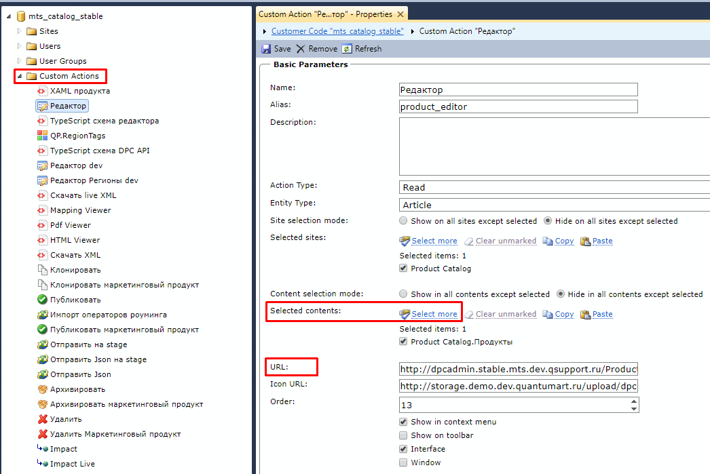

<br>

## XML Описания продуктов

### Создание статьи

1.  Создаем новую статью в контенте `ProductDefinitions` (Описания продуктов)

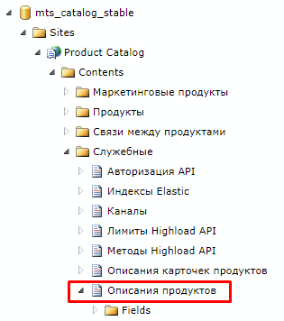

2.  Заполняем следующие поля:

* `Title` — Название.
* `Content` — Контент, статьи которого мы будем редактировать.
* `ApplyToTypes` — Типы продуктов (заполняем, если сделать редактор только для конкретных типов продукта).
* `EditorViewPath` — Путь к созданной точке входа относительно `~\Views\ProductEditor`. Пример: `MyEditor\Index`.  
   Или абсолютный путь: `~\Views\ProductEditor\MyEditor\Index`.
* `XmlDefinition` — XML Описание (заполняем в отдельном окне)

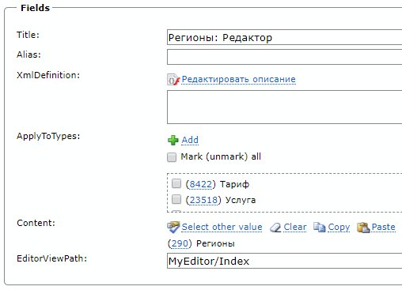

### Настройка контентов

3.  Настраиваем определение для контента:

* `Только для чтения` — Использовать выбранный контент только для чтения. Каждый контент одного и того же типа (см. поле-классификатор `Type`) может быть включен в определение продукта сколько угодно раз с флагом `Только для чтения`, но только один раз без него (для редактирования).
* `Грузить все простые поля` — Отображать в редакторе все простые поля (не связи) из QP, даже если они явно не включены в XML-описание.

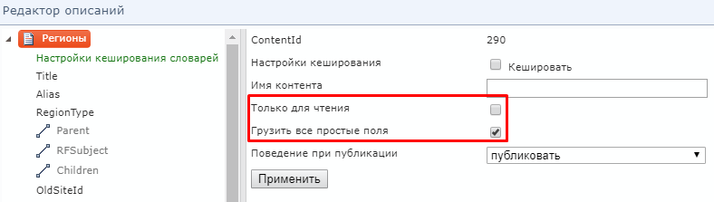

### Простые поля

4.  Добавляем простые поля:

* `Включить в описание`
* `Имя поля` — Название поля в JSON (переопреледяет данные из QP).
* `Имя поля для карточки` — Label для поля в редакторе (переопреледяет данные из QP).

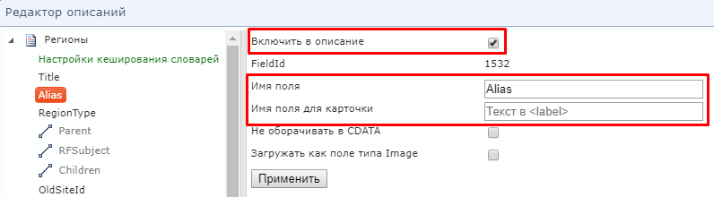

### Поля-связи

5.  Добавляем поля-связи:

* `При клонировании родительской сущности` **CloningMode** — Что делать со cвязью, когда клонируется родительская статья.
* `При удалении родительской сущности или удалении связи` **DeletingMode** — Удалять )архивировать) ли статьи-связи вместе с родительской статьей
* `При создании\обновлении` **UpdatingMode** — Применять ли изменения в статьях-связях при сохранении изменений родительской статьи.
* `PreloadingMode` — Загружать ли все возможные значения поля-связи заранее. Возможные варианты:
  * `не загружать` **PreloadingMode.None** — Всегда выбирать статьи-связи в диалоговом окне QP
  * `загружать сразу` **PreloadingMode.Eager** — Заранее загрузить все возможные статьи связи для данного поля. Это позволит выбирать значения поля-связи из комбо-бокса или списка чекбоксов, без открытия QP.
  * `загружать отложенно` **PreloadingMode.Lazy** — Загрузить все возможные статьи связи для данного поля только при первом отображении этого поля в редакторе. Это позволит выбирать значения поля-связи из комбо-бокса или списка чекбоксов, без открытия QP.
* `RelationCondition` — SQL-фильтр для выбора допустимых статей поля-связи. Подставляется в блок `WHERE` при фильтрации статей в диалоговом окне QP или при предзагрузке допустимых статей-связей. Фильтруемый контент обозначается алиасом `c`. Пример: `c.Type = 343` (Тарифы). Если поле не заполнено, то его значение берется из `RelationCondition` в QP.
* `ClonePrototypeCondition` — SQL-условие для выбора единственной статьи-шаблона, которая используется для создания статьи-связи по образцу контент обозначается алиасом `c`. Пример: `c.Alias = 'my_region_template'`. Если поле не заполнено, то создание по обрацу будет недоступно.

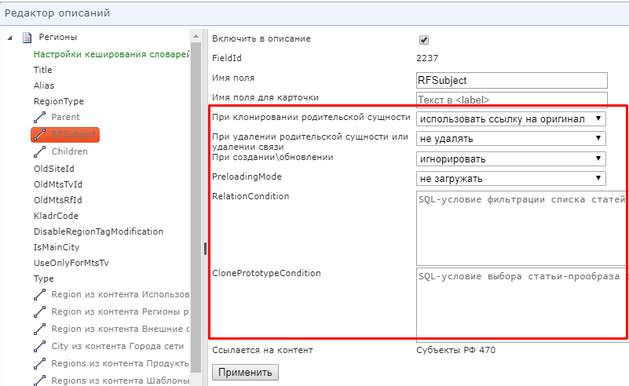

6.  Добавляем обратные поля-связи:

То же самое, что и для связей, но необходимо явно переопределить `Имя поля`, т.к. BackwardRelation отсутствует в QP. В примере ниже, статья `Region` будет иметь поле `TariffZones`, содержащее массив статей `TariffZone`

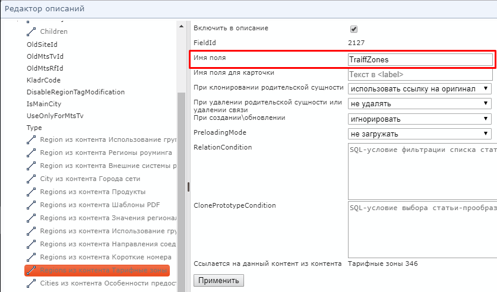

Так же можно добавить обратное поле-связь для уже включенного в описание прямого поля. Но при этом, контент, который содержится в обратном поле обязательно должен иметь флаг `Только для чтения`.

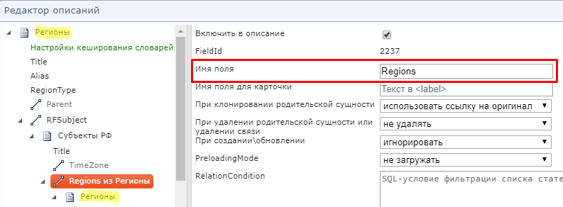
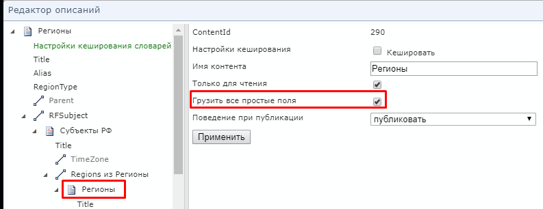

### Поля-расширения

7.  Добавляем поля-классификаторы:

Выбираем допустимые контенты-расширения для данного поля (вручную редактируя XML).

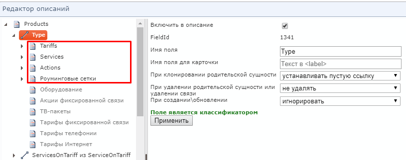

8.  Повторяем п. 1 — п.7 для всех необходимых связей продукта.

### Кеширование

9.  Настраиваем кеширование:

Добавляем поле `Настройки кеширования словарей` и включем туда контенты-справочники, которые редко изменяются (и которые не редактируются в нашем редакторе)

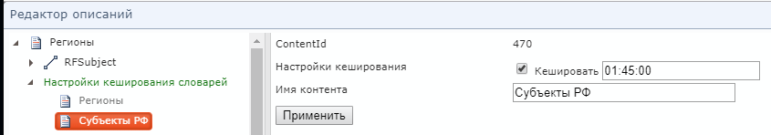

### XAML-ссылки

10. При большом желании можно добавить XAML-ссылки на описание контентов, и зациклить описание продукта на себя:

```xml
<Content x:Name="__ReferenceID0" ContentId="290" xmlns="http://artq.com/configuration" xmlns:x="http://schemas.microsoft.com/winfx/2006/xaml">
  <EntityField CloningMode="UseExisting" FieldId="1140" FieldName="Children">
    <x:Reference>__ReferenceID0</x:Reference>
  </EntityField>
</Content>
```

11. Сохраняем сначала изменения в XML, а потом статью с описанием продукта:

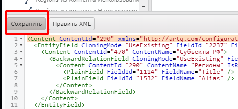
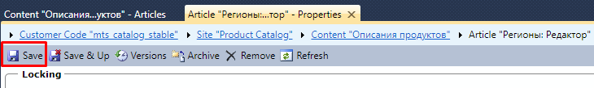

<br>

## Схема TypeScript

\*\* Если не нужны фишки TypeScript вроде автокомплита по именам полей статей QP или проверки типов, этот пункт можно пропустить.

Выгружаем TypeScript-описание контентов, с которыми мы будем работать в редакторе.
Выделяем статью XML описания продукта и вызываем в контекстном меню пункт **TypeScript схема редактора**

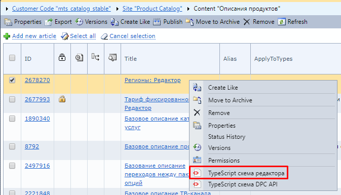

Должен скачатся файл `TypeScriptSchema.ts`, содержащий интерфейсы объектов (например `Product`, `MarketingProduct`, `Region`) и интерфейс **`Tables`**, описывающий все таблицы QP, затронутые в нашем редакторе.

Кладем файл `TypeScriptSchema.ts` в папку редактора `~\Views\ProductEditor\MyEditor\` рядом с нашей точкой входа `MyEditor\Index.tsx`.

<br>

## Инициализация редактора

Добавляем корневой компонент `<ProductEditor>` в нашу точку входа `MyEditor\Index.tsx`

**MyEditor\Index.tsx**

```jsx
import { ProductEditor } from "Components/ProductEditor/ProductEditor";
import { EntityEditor } from "Components/ArticleEditor/EntityEditor";
import { Region } from "./TypeScriptSchema";

const App = () => (
  <ProductEditor editorSettings={window["ProductEditorSettings"]}>
    {(model: Region, contentSchema) => (
      <EntityEditor model={model} contentSchema={contentSchema} />
    )}
  </ProductEditor>
);
```

В компоненте `<ProductEditor>` осуществляется регистрация и настройка сервисов в DI-контейнере.
Для этого ему передаются настройки:

* `editorSettings` — настройки, переданные с сервера (обязательно)
* `queryParams?` — URL-параметры корневого CustomAction (при отсутствии берутся из `document.location`)
* `publicationTrackerSettings?` — Настройки синхронизации статусов публикации продуктов (опционально)

Затем `<ProductEditor>` загружает схему и данные продукта в формате JSON и нормализует их в виде таблиц.

После того, как данные будут получены, `<ProductEditor>` передает корневую статью продукта
и схему ее контента в Render Callback. На этом этапе мы можем либо написать свои компоненты,
отображающие продукт по его данным и схеме, либо использовать стандартный компонент `<EntityEditor>`.

<br>

## Модель данных

### Данные

Данные продукта представлены в виде графа моделей [mobx-state-tree](https://github.com/mobxjs/mobx-state-tree).
Поля статей QP являются простыми полями объектов JavaScript, а связи — массивами объектов.
См. `~/ClientApp/Models/EditorDataModels.ts`.

Каждый объект статья имеет служебные поля:

* `_ClientId` — Id статьи на клиенте. Неизменяем. Для статей которые загружены с сервера совпадает с `CONTENT_ITEM_ID`,
  а для созданных на клиенте — генерируется автоинкрементный отрицательный Id (-1, -2, -3, ...).
* `_ServerId` — Id статьи после сохранения на сервере. Совпадает с `CONTENT_ITEM_ID`
  Для новых, еще не сохраненных статей выставляется в `null`.
* `_Modified` — Дата и время последнего изменения статьи.
* `_IsExtension` — Признак того, что статья является статьей-расширением.
* `_IsVirtual` — Признак того, что статья является виртуальной, и не должна быть сохранена на сервере.

#### Статьи-расширения

Все статьи делятся на два типа: `EntityObject` — статья-сущность (например `Product`, `Region`)
и `ExtensionObject` — статья-расширение (например `InternetTariff`).

Если контент имеет поле-расширение, то его объекты выглядят следующим образом:

```ts
interface <имя контента> extends EntityObject {
  <имя поля расширения>: <значение поля расширения>
  <имя поля расширения>_Extension: {
    <имя контента расширения 1>: <расширение 1>
    <имя контента расширения 2>: <расширение 2>
    // ...
  }
}
```

Пример:

```ts
interface Product extends EntityObject {
  // ...
  Type: "InternetTariff" | "PhoneTariff";
  Type_Extension: {
    InternetTariff: InternetTariff;
    PhoneTariff: PhoneTariff;
  };
  // ...
}

interface InternetTariff extends ExtensionObject {
  // ...
}

interface PhoneTariff extends ExtensionObject {
  // ...
}
```

#### Предыдущие значения полей

Каждый объект статьи реализует интерфейс `ValidatableObject`.
См. `~/ClientApp/Packages/mst-validation-mixin.tsx`.

Для получения значения поля, каким оно было до первого редактирования есть метод `getBaseValue(name: string)`.
Пример:

```ts
const region: Region;
// получение предыдущего значения поля Children
region.getBaseValue("Children");
```

* Если поле не было изменено, то возвращаетя его текущее значение.
* При сохранении статьи с помощью `EntityController.saveEntity()` или перезагрузке
  в `EntityController.reloadEntity()`, состояние базовых значений полей сбрасывается.
  И базовые значения становятся равными текущим значениям.

#### DataContext

DataContext — это класс, который хранит в себе все статьи продукта в виде таблиц по названиям контентов.
См. `~/ClientApp/Services/DataContext.ts`.

```ts
class DataContext {
  tables: {
    [contentName: string]: Map<string, EntityObject>;
  };
  createEntity(contentName: string, properties?: Object): EntityObject;
  deleteEntity(entity: EntityObject): void;
}
```

* `tables` — Набор таблиц. Каждая таблица представляет собой ES6 Map со строковым ключем,
  сожержащим `EntityObject._ClientId`, и значением `EntityObject`. Статьи расширения не представлены
  в виде таблиц, и доступны только по ссылкам из полей статей-сущностей.
* `createEntity` — Метод создания статьи по имени контента. Также можно передать значения полей в виде объекта.
  При этом статья создается только в памяти и **НЕ СОХРАНЯЕТСЯ НА СЕРВЕРЕ**.
* `deleteEntity` — Метод удаляющий статью. Статья удаляется только из памяти и **НЕ УДАЛЯЕТСЯ НА СЕРВЕРЕ**.

Для применения изменений на сервере необходимо вызвать `EntityController.saveEntity()` на конкретной статье.

Получить к нему доступ можно следующим образом:

```jsx
import { inject } from "react-ioc";
import { DataContext } from "Services/DataContext";
import { Tables } from "../TypeScriptSchema";

class MyComponent extends Component {
  // получаем типизированный DataContext (имена конетнтов-таблиц определены)
  @inject dataContext: DataContext<Tables>;

  doSomething() {
    this.dataContext; // ...
  }
}
```

<br>

### Схема

См. `~\ClientApp\Models\EditorSchemaModels.ts`. Схема представлена двумя интерфейсами: `ContentSchema` и `FieldSchema`.
Концептуально они связаны следующим образом:

```ts
interface ContentSchema {
  // ...
  Fields: {
    [name: string]: FieldSchema;
  };
}

interface FieldSchema {
  // обратная ссылка на схему контента, содержащую поле
  ParentContent: ContentSchema;
  // ...
}

// схема поля-связи
interface RelationFieldSchema extends FieldSchema {
  // ссылка на схему контента для поля-связи
  RelatedContent: ContentSchema;
}

// схема поля-расширения
interface ExtensionFieldSchema extends FieldSchema {
  ExtensionContents: {
    [contentName: string]: ContentSchema;
  };
}
```

Объекты схемы содержат метаинформацию о контентах и полях QP, такую как имена, типы, значения по умолчанию,
идентификаторы и т.п. Она используется при построении форм редактора и валидации. Для каждого типа поля QP
существует свой тип схемы, такой как `StringFieldSchema`, `NumericFieldSchema`, etc.

<br>

## TODO: Форма редактирования статьи

<br>

## TODO: Редакторы полей-связей

### TODO: Кастомные кнопки действий

<br>

## TODO: Сохранение подграфа статей

### TODO: Разрешение конфликтов

<br>

## TODO: Валидация

### TODO: Валидация подграфа статей

<br>

## TODO: Действия со статьями

<br>

## TODO: Действия с полями-связями

<br>

## TODO: Отслеживание состояния публикации

<br>

## TODO: Показ уведомлений

</main>
