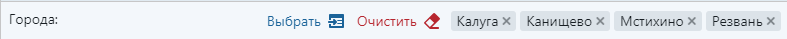
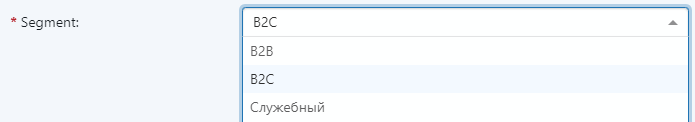
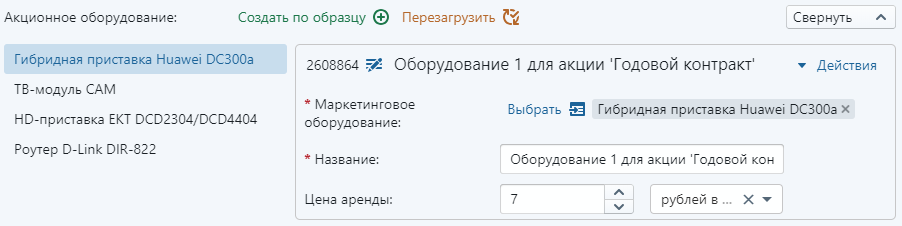
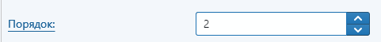
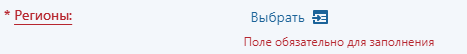
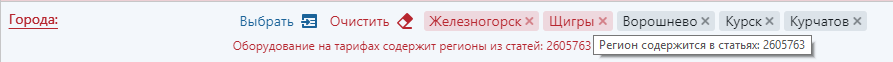
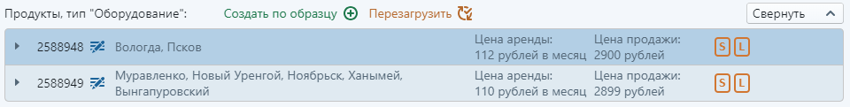
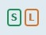

<aside style="position: fixed; top: 0; right: 10px">

- [Точка входа](#Точка-входа)
  - [CustomAction](#CustomAction)
- [XML Описания продуктов](#XML-Описания-продуктов)
  - [Создание статьи](#Создание-статьи)
  - [Настройка контентов](#Настройка-контентов)
  - [Простые поля](#Простые-поля)
  - [Поля-связи](#Поля-связи)
  - [Поля-расширения](#Поля-расширения)
  - [Кеширование](#Кеширование)
  - [XAML-ссылки](#XAML-ссылки)
- [Схема TypeScript](#Схема-TypeScript)
- [Инициализация редактора](#Инициализация-редактора)
- [Модель данных](#Модель-данных)
  - [Данные](#Данные)
    - [Статьи-расширения](#Статьи-расширения)
    - [Предыдущие значения полей](#Предыдущие-значения-полей)
    - [DataContext](#DataContext)
  - [Схема](#Схема)
- [Форма редактирования статьи](#Форма-редактирования-статьи)
  - [Порядок полей](#Порядок-полей)
  - [Редакторы полей](#Редакторы-полей)
  - [Form Controls](#Form-Controls)
- [Редакторы полей-связей](#Редакторы-полей-связей)
  - [Привязка редакторов](#Привязка-редакторов)
- [Действия со статьями](#Действия-со-статьями)
  - [Dependency Injection](#Dependency-Injection)
  - [Кастомные действия](#Кастомные-действия)
  - [Сохранение подграфа статей](#Сохранение-подграфа-статей)
  - [Конфликты при сохранении](#Конфликты-при-сохранении)
- [Валидация](#Валидация)
- [Локализация](#Локализация)
- [Отслеживание состояния публикации](#Отслеживание-состояния-публикации)
- [Показ уведомлений](#Показ-уведомлений)

</aside>
<main style="width: 900px">

# Создание редактора DPC

## Точка входа

1.  В каталог `~\Views\ProductEditor` создаем новый каталог с именем нашего редактора `MyEditor`.

2.  В новом каталоге создаем два файла, например `Index.cshtml` и `Index.jsx`, или `MyEditor.cshtml` и `MyEditor.tsx`.

**MyEditor\Index.cshtml**

```html
@model QA.ProductCatalog.Admin.WebApp.Models.ProductEditorSettingsModel
@{ Layout = null; }
<!DOCTYPE html>
<html>
<head root-url="@Url.Content("~")">
  <meta charset="utf-8" />
  <meta http-equiv="X-UA-Compatible" content="IE=Edge" />
  <title>@(ViewBag.Title ?? "DPC")</title>
  <style type="text/css">
    html {
      background-color: #f5f8fa;
    }
  </style>
  <script src="https://cdn.polyfill.io/v2/polyfill.min.js?features=es6,fetch,Array.prototype.includes,Object.values,Object.entries,Element.prototype.closest"></script>
  @Model.SerializeSettings()
</head>
<body>
  <div id="editor"></div>
  <script src="@Url.VersionedContent("~/js/bundles/ProductEditor/MyEditor/Index.js")"></script>
</body>
</html>
```

**MyEditor\Index.tsx**

```jsx
import "Environment"; // Импортируем базовые стили и код (обязательно)
import React from "react";
import ReactDOM from "react-dom";

const App = () => null;

ReactDOM.render(<App />, document.getElementById("editor"));
```

### CustomAction

3.  Создаем в QP CustomAction с названием "Редактор" (или как Вам нравится).
    Если такой CustomAction уже есть, то можно просто добавить интересующий нас Content в поле `Selected contents`.

Заполняем поля:

- `Selected contents` — Контент, статьи которого мы будем редактировать.
- `URL` — `http://{адрес}/ProductEditor/Edit`, где `{адрес}` это адрес приложения `QA.ProductCatalog.Admin.WebApp`.


<br><hr><br>

## XML Описания продуктов

### Создание статьи

1.  Создаем новую статью в контенте `ProductDefinitions` (Описания продуктов)


2.  Заполняем следующие поля:

- `Title` — Название.
- `Content` — Контент, статьи которого мы будем редактировать.
- `ApplyToTypes` — Типы продуктов (заполняем, если сделать редактор только для конкретных типов продукта).
- `EditorViewPath` — Путь к созданной точке входа относительно `~\Views\ProductEditor`. Пример: `MyEditor\Index`.  
   Или абсолютный путь: `~\Views\ProductEditor\MyEditor\Index`.
- `XmlDefinition` — XML Описание (заполняем в отдельном окне)


### Настройка контентов

3.  Настраиваем определение для контента:

- `Только для чтения` — Использовать выбранный контент только для чтения. Каждый контент одного и того же типа (см. поле-классификатор `Type`) может быть включен в определение продукта сколько угодно раз с флагом `Только для чтения`, но только один раз без него (для редактирования).
- `Грузить все простые поля` — Отображать в редакторе все простые поля (не связи) из QP, даже если они явно не включены в XML-описание.


### Простые поля

4.  Добавляем простые поля:

- `Включить в описание`
- `Имя поля` — Название поля в JSON (переопреледяет данные из QP).
- `Имя поля для карточки` — Label для поля в редакторе (переопреледяет данные из QP).


### Поля-связи

5.  Добавляем поля-связи:

- `При клонировании родительской сущности` **CloningMode** — Что делать со связью, когда клонируется родительская статья.
- `При удалении родительской сущности или удалении связи` **DeletingMode** — Удалять )архивировать) ли статьи-связи вместе с родительской статьей
- `При создании\обновлении` **UpdatingMode** — Применять ли изменения в статьях-связях при сохранении изменений родительской статьи (см. [Сохранение подграфа статей](#Сохранение-подграфа-статей)).
- `PreloadingMode` — Загружать ли все возможные значения поля-связи заранее. Возможные варианты:
  - `не загружать` **PreloadingMode.None** — Всегда выбирать статьи-связи в диалоговом окне QP
  - `загружать сразу` **PreloadingMode.Eager** — Заранее загрузить все возможные статьи связи для данного поля. Это позволит выбирать значения поля-связи из комбо-бокса или списка чекбоксов, без открытия QP.
  - `загружать отложенно` **PreloadingMode.Lazy** — Загрузить все возможные статьи связи для данного поля только при первом отображении этого поля в редакторе. Это позволит выбирать значения поля-связи из комбо-бокса или списка чекбоксов, без открытия QP.
- `RelationCondition` — SQL-фильтр для выбора допустимых статей поля-связи. Подставляется в блок `WHERE` при фильтрации статей в диалоговом окне QP или при предзагрузке допустимых статей-связей. Фильтруемый контент обозначается алиасом `c`. Пример: `c.Type = 343` (Тарифы). Если поле не заполнено, то его значение берется из `RelationCondition` в QP.
- `ClonePrototypeCondition` — SQL-условие для выбора единственной статьи-шаблона, которая используется для создания статьи-связи по образцу контент обозначается алиасом `c`. Пример: `c.Alias = 'my_region_template'`. Если поле не заполнено, то создание по обрацу будет недоступно.


6.  Добавляем обратные поля-связи:

То же самое, что и для связей, но необходимо явно переопределить `Имя поля`, т.к. BackwardRelation отсутствует в QP. В примере ниже, статья `Region` будет иметь поле `TariffZones`, содержащее массив статей `TariffZone`


Так же можно добавить обратное поле-связь для уже включенного в описание прямого поля. Но при этом, контент, который содержится в обратном поле обязательно должен иметь флаг `Только для чтения`.


### Поля-расширения

7.  Добавляем поля-классификаторы:

Выбираем допустимые контенты-расширения для данного поля (вручную редактируя XML).


8.  Повторяем п. 1 — п.7 для всех необходимых связей продукта.

### Кеширование

9.  Настраиваем кеширование:

Добавляем поле `Настройки кеширования словарей` и включем туда контенты-справочники, которые редко изменяются (и которые не редактируются в нашем редакторе)


### XAML-ссылки

10. При большом желании можно добавить XAML-ссылки на описание контентов, и зациклить описание продукта на себя:

```xml
<Content x:Name="__ReferenceID0" ContentId="290" xmlns="http://artq.com/configuration" xmlns:x="http://schemas.microsoft.com/winfx/2006/xaml">
  <EntityField CloningMode="UseExisting" FieldId="1140" FieldName="Children">
    <x:Reference>__ReferenceID0</x:Reference>
  </EntityField>
</Content>
```

11. Сохраняем сначала изменения в XML, а потом статью с описанием продукта:


<br><hr><br>

## Схема TypeScript

\*\* Если не нужны фишки TypeScript вроде автокомплита по именам полей статей QP или проверки типов, этот пункт можно пропустить.

Выгружаем TypeScript-описание контентов, с которыми мы будем работать в редакторе.
Выделяем статью XML описания продукта и вызываем в контекстном меню пункт **TypeScript схема редактора**


Должен скачатся файл `TypeScriptSchema.ts`, содержащий интерфейсы объектов (например `Product`, `MarketingProduct`, `Region`) и интерфейс **`Tables`**, описывающий все таблицы QP, затронутые в нашем редакторе.

Кладем файл `TypeScriptSchema.ts` в папку редактора `~\Views\ProductEditor\MyEditor\` рядом с нашей точкой входа `MyEditor\Index.tsx`.

<br><hr><br>

## Инициализация редактора

Добавляем корневой компонент `<ProductEditor>` в нашу точку входа `MyEditor\Index.tsx`

**MyEditor\Index.tsx**

```jsx
import { ProductEditor } from "Components/ProductEditor/ProductEditor";
import { EntityEditor } from "Components/ArticleEditor/EntityEditor";
import { Region } from "./TypeScriptSchema";

const App = () => (
  <ProductEditor editorSettings={window["ProductEditorSettings"]}>
    {(model: Region, contentSchema) => (
      <EntityEditor model={model} contentSchema={contentSchema} />
    )}
  </ProductEditor>
);
```

В компоненте `<ProductEditor>` осуществляется регистрация и настройка сервисов в DI-контейнере.
Для этого ему передаются настройки:

- `editorSettings` — настройки, переданные с сервера (обязательно)
- `queryParams?` — URL-параметры корневого CustomAction (при отсутствии берутся из `document.location`)
- `publicationTrackerSettings?` — Настройки синхронизации статусов публикации продуктов (опционально)

Затем `<ProductEditor>` загружает схему и данные продукта в формате JSON и нормализует их в виде таблиц.

После того, как данные будут получены, `<ProductEditor>` передает корневую статью продукта
и схему ее контента в Render Callback. На этом этапе мы можем либо написать свои компоненты,
отображающие продукт по его данным и схеме, либо использовать стандартный компонент `<EntityEditor>`.

<br><hr><br>

## Модель данных

### Данные

Данные продукта представлены в виде графа моделей [mobx-state-tree](https://github.com/mobxjs/mobx-state-tree).
Поля статей QP являются простыми полями объектов JavaScript, а связи — массивами объектов.
См. `~/ReactViews/ProductEditor/Models/EditorDataModels.ts`.

Каждый объект статья имеет служебные поля:

- `_ClientId` — Id статьи на клиенте. Неизменяем. Для статей которые загружены с сервера совпадает с `CONTENT_ITEM_ID`,
  а для созданных на клиенте — генерируется автоинкрементный отрицательный Id (-1, -2, -3, ...).
- `_ServerId` — Id статьи после сохранения на сервере. Совпадает с `CONTENT_ITEM_ID`
  Для новых, еще не сохраненных статей выставляется в `null`.
- `_Modified` — Дата и время последнего изменения статьи.
- `_IsExtension` — Признак того, что статья является статьей-расширением.
- `_IsVirtual` — Признак того, что статья является виртуальной, и не должна быть сохранена на сервере.

#### Статьи-расширения

Все статьи делятся на два типа: `EntityObject` — статья-сущность (например `Product`, `Region`)
и `ExtensionObject` — статья-расширение (например `InternetTariff`).

Если контент имеет поле-расширение, то его объекты выглядят следующим образом:

```ts
interface <имя контента> extends EntityObject {
  <имя поля расширения>: <значение поля расширения>
  <имя поля расширения>_Extension: {
    <имя контента расширения 1>: <расширение 1>
    <имя контента расширения 2>: <расширение 2>
    // ...
  }
}
```

Пример:

```ts
interface Product extends EntityObject {
  // ...
  Type: "InternetTariff" | "PhoneTariff";
  Type_Extension: {
    InternetTariff: InternetTariff;
    PhoneTariff: PhoneTariff;
  };
  // ...
}

interface InternetTariff extends ExtensionObject {
  // ...
}

interface PhoneTariff extends ExtensionObject {
  // ...
}
```

#### Предыдущие значения полей

Каждый объект статьи реализует интерфейс `ValidatableObject`. См. `~/ReactViews/ProductEditor/Packages/mst-validation-mixin.tsx`.

Для получения значения поля, каким оно было до первого редактирования есть метод `getBaseValue(name: string)`.
Пример:

```ts
const region: Region;
// получение предыдущего значения поля Children
region.getBaseValue("Children");
```

- Если поле не было изменено, то возвращаетя его текущее значение.
- При сохранении статьи с помощью `EntityController.saveEntity()` или перезагрузке
  в `EntityController.reloadEntity()`, состояние базовых значений полей сбрасывается.
  И базовые значения становятся равными текущим значениям.

#### DataContext

DataContext — это класс, который хранит в себе все статьи продукта в виде таблиц по названиям контентов.
См. `~/ReactViews/ProductEditor/Services/DataContext.ts`.

```ts
class DataContext {
  tables: {
    [contentName: string]: Map<string, EntityObject>;
  };
  createEntity(contentName: string, properties?: Object): EntityObject;
  deleteEntity(entity: EntityObject): void;
}
```

- `tables` — Набор таблиц. Каждая таблица представляет собой ES6 Map со строковым ключем,
  сожержащим `EntityObject._ClientId`, и значением `EntityObject`. Статьи расширения не представлены
  в виде таблиц, и доступны только по ссылкам из полей статей-сущностей.
- `createEntity` — Метод создания статьи по имени контента. Также можно передать значения полей в виде объекта.
  При этом статья создается только в памяти и **НЕ СОХРАНЯЕТСЯ НА СЕРВЕРЕ**.
- `deleteEntity` — Метод удаляющий статью. Статья удаляется только из памяти и **НЕ УДАЛЯЕТСЯ НА СЕРВЕРЕ**.

Для применения изменений на сервере необходимо вызвать `EntityController.saveEntity()` на конкретной статье.

Получить к нему доступ можно следующим образом:

```jsx
import { inject } from "react-ioc";
import { DataContext } from "Services/DataContext";
import { Tables } from "../TypeScriptSchema";

class MyComponent extends Component {
  // получаем типизированный DataContext (имена конетнтов-таблиц определены)
  @inject dataContext: DataContext<Tables>;

  doSomething() {
    this.dataContext; // ...
  }
}
```

<br><hr><br>

### Схема

См. `~\ReactViews/ProductEditor\Models\EditorSchemaModels.ts`. Схема представлена двумя интерфейсами: `ContentSchema` и `FieldSchema`.
Концептуально они связаны следующим образом:

```ts
interface ContentSchema {
  // ...
  Fields: {
    [name: string]: FieldSchema;
  };
}

interface FieldSchema {
  // обратная ссылка на схему контента, содержащую поле
  ParentContent: ContentSchema;
  // ...
}

// схема поля-связи
interface RelationFieldSchema extends FieldSchema {
  // ссылка на схему контента для поля-связи
  RelatedContent: ContentSchema;
}

// схема поля-расширения
interface ExtensionFieldSchema extends FieldSchema {
  ExtensionContents: {
    [contentName: string]: ContentSchema;
  };
}
```

Объекты схемы содержат метаинформацию о контентах и полях QP, такую как имена, типы, значения по умолчанию,
идентификаторы и т.п. Она используется при построении форм редактора и валидации. Для каждого типа поля QP
существует свой тип схемы, такой как `StringFieldSchema`, `NumericFieldSchema`, etc.

<br><hr><br>

## Форма редактирования статьи

Для отображения и редактрования статьи в виде формы нужно использовать компонент `<EntityEditor>` для статьи-сущности,
или `<ExtensionEditor>` для статьи-связи. См. `~\ReactViews/ProductEditor\Components\ArticleEditor\`.


Пример:

```jsx
import { EntityEditor } from "Components/ArticleEditor/EntityEditor";

const region: Region;
const contentSchema: ContentSchema;

<EntityEditor model={region} contentSchema={contentSchema} />;
```

### Порядок полей

Порядок полей по-умолчанию определяется порядком полей в QP. Но его можно переопределить в свойстве `fieldOrders`:

```jsx
import { EntityEditor } from "Components/ArticleEditor/EntityEditor";

<EntityEditor
  model={region}
  contentSchema={contentSchema}
  fieldOrders={["Title", "Parent"]}
/>;
```

Поля, указанные в `fieldOrders` будут следовать в описанном порядке. А не указанные будут отображены после них.

Также в свойстве `fieldOrders` можно определить порядок полей статьи-расширения. Они будут отображены на форме
вместе с полями статьи-сущности. Но разные поля одного контента-расширения не должны перемешиваться с полями
контента-сущности. Пример:

```jsx
interface Product extends EntityObject {
  Title: string;
  Type: "InternetTariff"
  Type_Extension: {
    InternetTariff: InternetTariff;
  },
  Order: number;
}

interface InternetTariff extends ExtensionObject {
  Price: number;
  Description: string;
}

const product: Product;

<EntityEditor /* ... */ fieldOrders={[
  "Title", "Type", // поля основной статьи
  "Price", "Description", // поля статьи расширения
  "Order" // поля основной статьи
 ]} />
```

### Редакторы полей

По-умолчанию, `<EntityEditor>` отображает все поля статьи с дефолтными редакторами полей. Но их можно переопределить
в свойстве `fieldEditors`. Редактором поля является произвольный React Component с полями:

```ts
type FieldEditorProps = { model: ArticleObject; fieldSchema: FieldSchema };
```

```jsx
import { IGNORE } from "Components/ArticleEditor/ArticleEditor";
import {
  StringFieldEditor,
  NumericFieldEditor
} from "Components/FieldEditors/FieldEditors";

<EntityEditor
  fieldEditors={{
    Title: StringFieldEditor, // задаем полю Title редактор StringFieldEditor
    Order: IGNORE, // скрываем поле Order; его значение остается неизменным
    Type: "InternetTariff", // задаем полю Type константное значение "InternetTariff"; поле будет скрыто
    Type_Extension: {
      // настраиваем редакторы полей для контентов-расширений
      InternetTariff: {
        Price: NumericFieldEditor // задаем полю Price статьи-расширения редактор NumericFieldEditor
      }
    }
  }}
/>;
```

Также существует флаг `skipOtherFields`, который убирает отображение полей, не описанных в свойстве `fieldEditors`.

В модуле `~/ReactViews/ProductEditor/Components/FieldEditors/FieldEditors` реализованы стандартные редакторы для простых полей
и полей связей, такие как `StringFieldEditor`, `FileFieldEditor`, `RelationFieldTable`, `RelationFieldAccordion`, etc.
Если нас не удовлетворяют стандартные редакторы полей, мы можем написать свой, или переопределитиь свойства по-умолчанию для существующих редакторов.

```jsx
import { RelationFieldForm } from "Components/FieldEditors/FieldEditors";

<EntityEditor
  fieldEditors={{
    // задаем полю MarketingProduct редактор RelationFieldForm
    MarketingProduct: props => <RelationFieldForm {...props} borderless />
  }}
  canSaveEntity
  canRemoveEntity
/>;
```

Также `<EntityEditor>` принимает настройки кнопок действий, которые можно совершить со статьей. Например, флаг `canSaveEntity` отвечает за доступность кнопки сохранения связанной статьи, а флаг `canRemoveEntity` за удаление статьи. Также принимаются коллбеки, выполняемые при нажатии на кнопку вместо стандартных действий, например `onCloneEntity` — вместо реального клонирования статьи. Полный список доступен в интерфейсе `EntityEditorProps`.

### Form Controls

Для разработки кастомных редакторов полей в модуле `~/ReactViews/ProductEditor/Components/FormControls/FormControls` доступны стандартные компоненты, работающие с реактивными объектами MobX:

- `<InputText>`
- `<InputNumber>`
- `<RadioGroup>`
- `<Select>`
- `<Datepicker>`
- etc

Они требуют два свойства (объект модели и имя поля):

```ts
type FormControlProps { model: Object; name: string; }
```

```jsx
const region: Region;

<InputText model={region} name="Title" />
```

Посмотреть их работу можно на тестовой странице  
`http://{host}:{port}/ProductEditor/ComponentLibrary?customerCode={customer_code}`


<br><hr><br>

## Редакторы полей-связей

Для редактирования связей доступны обычные и рекурсивные редадкторы.

Обычные просто отображают список связанных статей.

- `<RelationFieldTable>` — Отображение поля в виде таблицы.  
  Поддерживает кастомную подсветку элементов, сортировку, фильтрацию и realtime-валидацию.

  

- `<RelationFieldTags>` — Отображение поля в виде списка тэгов.  
  Поддерживает кастомную сортировку элементов, фильтрацию и realtime-валидацию.

  

- `<RelationFieldSelect>` — Отображение поля-связи в виде комбо-бокса с автокомплитом.  
  Требует `PreloadingMode.Eager` или `PreloadingMode.Lazy`.

  

- `<RelationFieldCheckList>` — Отображение поля-связи в виде списка чекбоксов.  
  Требует `PreloadingMode.Eager` или `PreloadingMode.Lazy`.

  

Рекурсивные же отображают внутри себя `<EntityEditor>` для каждой связанной статьи. Поэтому они
прокструют часть переданных свойств, таких как `fieldOrders`, `fieldEditors`, etc во внутренний `<EntityEditor>`.

- `<RelationFieldForm>` — Отображение единичного поля-связи в виде раскрывающейся формы редактирования.

  

- `<RelationFieldTabs>` — Отображение множественного поля-связи в виде вкладок (возможно вертикальных).  
  Поддерживает кастомную сортировку и фильтрацию элементов.

  

- `<RelationFieldAccordion>` — Отображение множественного поля-связи в виде раскрывающейся таблицы-аккордеона.  
  Поддерживает кастомную подсветку элементов, сортировку, фильтрацию и realtime-валидацию.

  

Пример:

```jsx
<RelationFieldAccordion
  model={marketingProduct}
  fieldSchema={contentSchema.Fields.Products as MultiRelationFieldSchema}
  filterItems={(product: Product) => product.Regions.includes(region)}
  sortItemsBy={(product: Product) => product._ServerId}
  columnProportions={[1, 3]}
  displayFields={[
    (product: Product) => product.MarketingProduct,
    (product: Product) => product.Regions.map(region => region.Title).join(", ")
  ]}
```

Также рекурсивные редакторы принимают настройки кнопок действий, которые можно совершить с отдельной связанной статьей
или с полем связи в целом. Например, флаг `canSaveEntity` отвечает за доступность кнопки сохранения связанной статьи,
а флаг `canReloadRelation` за доступность кнопки перезагрузки всего поля связи с сервера. Также принимаются коллбеки,
выполняемые при нажатии на кнопку вместо стандартных действий, например `onCloneEntity` — вместо реального клонирования статьи.
`***Entity` относятся к кнопкам в выпадающем меню формы редактирования статьи, а `***Relaton` к кнопкам поля-связи.
Полный список доступен в интерфейсе `ExpandableFieldEditorProps` в `~/ReactViews/ProductEditor/FieldEditors/AbstractFieldEditor`.

```jsx
<RelationFieldAccordion
  model={marketingProduct}
  fieldSchema={contentSchema.Fields.Products as MultiRelationFieldSchema}
  canReloadRelation // разрешить перезагрузку поля связи
  canCloneEntity // разрешить клонирование связанной статьи
  onCloneEntity={async (entity, cloneEntity) => {
    console.log({ entity });
    await cloneEntity(); // выполнить реальное клонирование
  }}
/>
```

### Привязка редакторов

Привязать редакторы связей к полям можно двумя способами:

- В свойстве `fieldEditors` компонентов `<EntityEditor>`, или `<RelationFieldForm>`, или `<RelationFieldTabs>`, или `<RelationFieldAccordion>` для каждого контента локально.

```jsx
<RelationFieldForm
  fieldEditors={{
    Products: props => (
      <RelationFieldAccordion
        {...props}
        filterItems={product => product.Regions.length > 0}
      />
    )
  }}
/>
```

- В свойстве `relationEditors` компонента `<ProductEditor>` глобально.

```jsx
<ProductEditor
  relationEditors={{
    Advantage: RelationFieldTable,
    Region: props => <RelationFieldTags {...props} sortItemsBy="Title" />
  }}
/>
```

В этом случае любые поля-связи ссылающиеся на контент с именем `Region` будут использовать редактор `<RelationFieldTags>`,
а с именем `Advantage` — `<RelationFieldTable>`.

<br><hr><br>

## Действия со статьями

Компонент `<EntityEditor>` содержит базовый набор действий совершаемых со статьей. Это:

- Сохранение на сервере
- Удаление с сервера
- Клонирование статьи
- Перезагрузка с сервера (несохраненные изменения отбрасываются)
- Обновление с сервера (несохраненные изменения остаются)
- Публикация подграфа статей (начиная с выбранной)

A также содержит Render Callback `customActions(entity: EntityObject): ReactNode` для добавления кастомных кнопок действий.
Кнопки действий доступны в выпадающем меню "Действия" в заголовке формы редактирования.

Рекурсивные редакторы полей, такие как `<RealtionFieldAccordion>` помимо проксирования настроек действий со статьей в `<EntityEditor>` содержат набор действий с полем связи. Это:

- Выбор связанных статей в модальном окне QP
- Создание статьи с нуля
- Создание статьи по образцу
- Удаление связи между конкретными статьями
- Очистка поля связи целиком
- Перезагрузка поля связи с сервера (несохраненные изменения отбрасываются)

A также содержат Render Callback-и:

- `entityActions(entity: EntityObject): ReactNode` — для добавления кастомных кнопок действий со статьей.
- `relationActions(): ReactNode` — для добавления кастомных кнопок действий с полем связи.

Логика этих действий реализована в сервисах:

- `EntityController` — Действия со статьями.

  - `refreshEntity()` — Обновление статьи с сервера (несохраненные изменения остаются).
  - `reloadEntity()` — Перезагрузка статьи с сервера (несохраненные изменения отбрасываются).
  - `editEntity()` — Открытие модального окна QP для редактирования статьи.
  - `publishEntity()` — Опубликовать продграф статей начиная с заданной, согласно XML ProductDefinition.
  - `removeRelatedEntity()` — Удаление статьи с сервера.
  - `cloneRelatedEntity()` — Клонирование подграфа статей начиная с заданной, согласно XML ProductDefinition.
  - `saveEntity()` — Сохранение подграфа статей начиная с заданной, согласно XML ProductDefinition.

- `RelationController` — Действия со связями.

  - `selectRelation()` — Открыть окно QP для выбора единичной связи.
  - `selectRelations()` — Открыть окно QP для выбора множественной связи.
  - `reloadRelation()` — Перезагрузить с сервера поле единичной связи.
  - `reloadRelations()` — Перезагрузить с сервера поле множественной связи.
  - `cloneProductPrototype()` — Создание статьи по образцу, и добавление в поле-связь.
  - `preloadRelationArticles()` — Предзагрузка всех допустимых статей для поля связи.  
    Используется только при `PreloadingMode.Lazy`.

- `FileController` — Интеграция с SiteLibrary QP.

  - `selectFile()` — Открыть окно SiteLibrary QP для выбора файла.
  - `previewImage()` — Открыть окно QP для предпросмотра изображения.
  - `downloadFile()` — Скачать файл из SiteLibrary.

- `ActionController` — Выполнение произвольных CustomAction.
  - `executeCustomAction()` — Найти CustomAction по Alias и выполнить его для заданной статьи.

Также методы данных контроллеров помечены декораторами (их можно использовать и в кастомном коде):

- `@modal` — запрет действий пользователя, пока выполняется асинхронный метод,

- `@progress` — показать полосу **NProgress**, пока выполняется асинхронный метод,

  

- `@handleError` — показать нотификацию "Произошла ошибка" при ошибке в методе,

  

- `@trace` — вывести название и время выполнения метода в консоль (в режиме разработки)

  

```ts
class MyComponent extends React.Component {
  @trace
  @modal
  @progress
  @handleError
  async doSomething() {}
}
```

### Dependency Injection

Получить доступ к этим сервисам можно с помощью декоратора `@inject`:

```ts
import { inject } from "react-ioc";

class MyComponent extends Component {
  @inject entityController: EntityController;
  @inject relationController: RelationController;
}
```

Зарегистрировать свои сервисы можно на уровне `<ProductEditor>`

```ts
import { inject } from "react-ioc";
import { ProductEditor } from "Components/ProductEditor/ProductEditor";

class FooService {}

class BarService {
  @inject fooService: FooService;
}

ProductEditor.bind(FooService, BarService);
```

Либо на уровне какого-то своего компонента:

```ts
import { provider } from "react-ioc";

@provider(FooService, BarService)
class MyComponent extends React.Component {}
```

### Кастомные действия

Примр: Кнопка клонирования статьи и открытия редактора в соседней вкладке

```jsx
import { inject } from "react-ioc";

class MyRelationFieldForm extends React.Component<FieldEditorProps> {
  @inject actionController: ActionController;
  @inject entityController: EntityController;

  cloneAndOpenInNewTab = async (entity: EntityObject) => {
    const { model, fieldSchema } = this.props;
    // клонируем статью entity, связанную со статьей model
    const clonedEntity = await this.entityController.cloneRelatedEntity(
      model,
      fieldSchema,
      entity
    );
    // находим CustomAction Редактора по Alias "product_editor"
    // и выполняем его для статьи-клона clonedEntity
    await this._actionController.executeCustomAction(
      "product_editor",
      clonedEntity,
      fieldSchema.RelatedContent
    );
  };

  render() {
    return (
      <RelationFieldForm
        {...this.props}
        entityActions={() => (
          <MenuItem
            labelElement={<Icon icon="duplicate" />}
            onClick={this.cloneAndOpenInNewTab}
            text="Клонировать"
          />
        )}
      />
    );
  }
}
```

### Сохранение подграфа статей

За сохранение изменений отвечает метод `EntityController.saveEntity()`. Он принимает два параметра:
объект-статью `EntityObject` и его схему `ContentSchema`. Схему для сохранения можно получить с помощью навигациии
по графу схем, начиная с корневой. Пример:

```ts
const regionContentSchema =
  marketingProductContentSchema.Fields.Products.RelatedContent.Fields.Regions
    .RelatedContent;
```

Сохраняются все изменения в подграфе статей, сделанные начиная от переданной статьи. При этом сохраняются измениия:

- в простых полях статьи,
- в полях-связях,
- во вложенных статьях-расширениях,
- в связанных статьях, поля-связи для которых имеют `UpdatingMode.Update` в XML Definition (см. [Поля-связи](#Поля-связи)).

Если для поля-связи установлен признак `UpdatingMode.Ignore`, то изменения самого поля (список связанных статей) применяются на сервере, а изменения в связанных статьях игнорируются. Для сохранения изменений таких статей нужно явно вызвать метод сохранения непосдедственно на каждой из них.

Также следует отметить, что серверный механизм сохранения изменений DPC **не поддерживает** изменения в полях-связях если

```ts
fieldSchema.FieldType === FieldExactTypes.M2ORelation &&
  fieldSchema.UpdatingMode === UpdatingMode.Ignore;
```

Редактирование таких связей будет недоступно. Для них разрешены только клонирование, удаление и создание по образцу. (см. `AbstractRelationFieldEditor._readonly`).

### Конфликты при сохранении

В процессе сохранения выполняются следующие действия:

(1) С подграфа статей собираются все ошибки валидации (начиная с переданной статьи, по связям с `UpdatingMode.Update`).
Если ошибки присутствуют — сохранение прерывается, а ошибки выводятся в модальном окне.

(2) Подграф статей сериализуется и отправляется на сервер.

(3) С сервера приходят обновленные данные (поля `_ServerId`, `_Modified`). Эти данные мерджатся в таблицы `DataContext`.

(4) Показывается [уведомление](#Показ-уведомлений) об успешном сохранении.

(3a) С сервера приходит `HTTP 409 Conflict` — это значит, что сохраняемые данные конфликтуют с изменениями другого пользователя.

(4а) Система пробует смержджить изменения автоматически. Если получается — пользователю предлагается проверить корректность слияния, и сохранить изменения снова.

(5а) Если смерджить данные не получается (на клиенте и на сервере изменено одно и то же поля), то пользователю [предлагается выбрать](#Показ-уведомлений)), какие изменения оставить, свои или с сервера. Затем проверить корректность слияния, и сохранить изменения снова.

<br><hr><br>

## Валидация

Каждый объект статьи реализует интерфейс `ValidatableObject`. См. `~/ReactViews/ProductEditor/Packages/mst-validation-mixin.tsx`.
Он содержит группы методов:

- `isTouched()` / `setTouched()` / `setUntouched()` — Пробовал ли пользователь редактировать данное поле.
- `isChanged()` / `setChenged()` / `setUnchanged()` — Было ли поле изменено с момента сохранения.
- `hasFocus()` / `setFocus()` — Находится ли поле в фокусе.
- `hasErrors()` / `getErrors()` / `addErrors()` / `clearErrors()` — Получение, добавление и удаление ошибок валидации (вручную).
- `addValidators()` / `removeValidators()` — Добавление и удаление функций-валидаторов.
- etc.

Также есть комбинированные методы:

- `isEdited()` — Поле побывало в фокусе и было изменено.
- `hasVisibleErrors()` / `getVisibleErrors()` — Поле побывало в фокусе и имеет ошибки.

Все методы являются реактивными (в смысле MobX).

Функция валидации `Validator` представляет собой обычную функцию, принимающую значение поля и возвращающую строку ошибки,
или `undefined` при отсутствии ошибки. Пример:

```ts
const required = value =>
  value == null || value == "" ? "Необходимо заполнить поле" : undefined;
```

Также валидаторы можно создавать с помощью фабрик:

```ts
const min = minValue => value =>
  value < minValue ? `Минимальное значение ${minValue}` : undefined;

const maxLength = length => value =>
  value.length > length ? `Максимальная длина: ${length}` : undefined;
```

Добавить валидации к полю можно через свойство `validate` [стандартных редакторов полей](#Редакторы-полей):

```jsx
const MyFieldEditor = props => (
  <NumberFieldEditor {...props} validate={min(5)} />
);

const AnotherFieldEditor = props => (
  <StringFieldEditor {...props} validate={[required, maxLength(10)]} />
);
```

Стандартные редакторы подсвечивают измененные поля синим цветом, а невалидные — красным:





А если мы разрабатываем свой тип редактора полей, то мы можем использовать обобщенный компонент `<Validate>`:

```jsx
<Validate
  model={articleObject} // объект статьи
  name={fieldSchema.FieldName} // имя поля
  rules={[required, maxLength(10)]} // правила валидации
/>
```

### Валидация элементов в редакторах связей

Валидация связанных статей в [рекурсивных редакторах связей](#Редакторы-полей-связей) происходит только при открытом вложенном редакторе `<EntityEditor>` т.е. только для одной связанной статьи в каждый момент времени. Валидируется только та вложенная статья, которую мы открыли для редактирования и сохранения. А в нерекурсивных редакторах связанные статьи вообще не валидируются.
Но иногда требуется проводить валидации для всех связанных статей сразу в режиме реального времени. Для этого в редакторах связей имеется свойство `validateItems: (item: EntityObject) => string`, принимающее функцию валидации.

Пример. Списки городов продуктов не должны пересекаться:

```jsx
const isUniqueRegion = (product: Product) => (region: Region) => {
  const otherProducts = product.MarketingProduct.Products;
  const productsWithSameRegions = otherProducts.filter(
    otherProduct =>
      otherProduct !== product && otherProduct.Regions.includes(region)
  );

  if (productsWithSameRegions.length > 0) {
    const productIds = productsWithSameRegions.map(
      product => product._ServerId || 0
    );
    return `Регион содержится в статьях: ${productIds.join(", ")}`;
  }
  return undefined;
};

const MyRegionsTags = props => (
  <RelationFieldTags
    {...props}
    sortItemsBy="Title"
    validateItems={isUniqueRegion(product)}
  />
);
```



### Подсветка изменений по вложенным статьям

Для подсветки изменений во вложенных статьях тип `ContentSchema` содержит методы обхода графа статей:

- `isEdited(article: ArticleObject)` — Была ли отредактирована хотя бы одна статья, входящая в продукт
  на основе обхода полей схемы .
- `isTouched(article: ArticleObject)` — Получала ли фокус хотя бы одна статья, входящая в продукт на основе обхода полей схемы.
- `isChanged(article: ArticleObject)` — Была ли изменена хотя бы одна статья, входящая в продукт на основе обхода полей схемы.
- `hasErrors(article: ArticleObject)` — Имеет ли ошибки хотя бы одна статья, входящая в продукт на основе обхода полей схемы.
- `hasVisibleErrors(article: ArticleObject)` — Имеет ли видимые ошибки хотя бы одна статья, входящая в продукт
  на основе обхода полей схемы.
- `getLastModified(article: ArticleObject): Date` — Получить максимальную дату модификации по всем статьям, входящим в продукт
  на основе обхода полей схемы.

Например:

```ts
interface Product extends EntityObject {
  Title: string;
  Parameters: ProductParameter[];
}

interface ProductParameter extends EntityObject {
  Title: string;
  Value: number; // поле было изменено и стало невалидным
}

// тогда:
const product: Product;
product.isEdited() === false;
product.hasErrors() === false;
product.Parameters[0].isEdited() === true;
product.Parameters[0].hasErrors() === true;
productContentSchema.isEdited(product) === true;
productContentSchema.hasErrors(product) === true;
```

Редактор полей связей `<RelationFieldAccordion>` по умолчанию использует такие методы для подсветки измененных статей:



<br><hr><br>

## Локализация

Локаль пользователя автоматически пробрасывается из настроек пользователя в QP
в формате RFC 3066 (`en-US`, `ru-RU`, `kk-KZ`, etc.). Она автоматически пробрасывается в `<DatePicker>`,
а также доступна с помощью React Context `LocaleContext` (см. `~/ReactViews/ProductEditor/Packages/react-lazy-i18n.tsx`).

```jsx
import { LocaleContext } from "react-lazy-i18n";

const MyComponent = props => (
  <LocaleContext.Consumer>
    {(locale: string) => <div>User's Locale: {locale}</div>}
  </LocaleContext.Consumer>
);
```

### Локализация React компонентов

Допустим, нам нужно локализовать компонент `<UserProfile>`:

```jsx
class UserProfile extends React.Component {
  render() {
    const { firstName, lastName } = this.props;
    return (
      <article>
        Hello, {firstName}!<div>First Name: {firstName}</div>
        <div>Last Name: {lastName}</div>
        <footer>
          Full Name: {firstName} {lastName}
        </footer>
      </article>
    );
  }
}
```

1.  Создаем файл с переводами`./UserProfile.ru-RU.jsx`:

```jsx
export default {
  "First Name": "Имя",
  "Last Name": "Фамилия",
  "Hello, ${firstName}!": firstName => `Привет, ${firstName}!`,
  footer: (firstName, lastName) => (
    <footer>
      Полное Имя: {firstName} {lastName}
    </footer>
  )
};
```

Файл переводов экспортирует JavaScript-объект, значениями которого являются строки и функции,
возвращающие строки или даже JSX разметку.

2.  Используем HOC `withTranslation()`, который внедряет функцию перевода в свойство `tr`:

```jsx
import { withTranslation } from "react-lazy-i18n";

@withTranslation(lang =>
  import(/* webpackChunkName: "i18n-" */ `./UserProfile.${lang}.jsx`)
)
class UserProfile extends React.Component {
  render() {
    const { tr, firstName, lastName } = this.props;
    return (
      <article>
        {tr`Hello, ${firstName}!`}
        <div>
          {tr`First Name`}: {firstName}
        </div>
        <div>
          {tr`Last Name`}: {lastName}
        </div>
        {tr("footer", firstName, lastName) || (
          <footer>
            Full Name: {firstName} {lastName}
          </footer>
        )}
      </article>
    );
  }
}
```

HOC `withTranslation()` принимает функцию, которая при изменении локали динамически подгружает запрошенный перевод.
С помощью `webpackChunkName` все переводы по одному языку складываются в один бандл и подгружаются по требованию.

Функция перевода `tr` работает в даух режимах:

- Как ES6 template tag она вычисляет ключ и аргументы для локализации на основе шаблона. А если ключ отсутствует в файле перевода, то сам ES6 шаблон используется как fallback.
- Как обычная функция, она использует первый аргумент в качестве ключа, а остальные — как аргументы для найденного шаблона перевода. Если ключ отсутствует в файле перевода, то возвращается `null`.

Также функция `tr` имеет свойство `tr.locale`, содержащее текущую локаль.

Переводы вышестоящего компонента доступны в компонентах вниз по Virtual DOM дереву, для которых в HOC `withTranslation()` не указана функция загрузки перевода. Пример:

```jsx
// UserProfile.jsx
import { withTranslation } from "react-lazy-i18n";

@withTranslation(lang =>
  import(/* webpackChunkName: "i18n-" */ `./UserProfile.${lang}.jsx`)
)
class UserProfile extends React.Component {
  render() {
    return <UserProfileHeader />;
  }
}
```

```jsx
// UserProfileHeader.jsx
import { withTranslation } from "react-lazy-i18n";

@withTranslation()
class UserProfile extends React.Component {
  render() {
    const { tr } = this.props;
    return <div>{tr`Hello!`}</div>;
  }
}
```

<br><hr><br>

## Отслеживание состояния публикации

За состояние публикации продуктов отвечают сервисы `PublicationContext` и`PublicationTracker`. `PublicationTracker` с определенной периодичностью затягивает последние изменения из таблицы `dbo.Products` и обновляет статусы публикации продуктов на Stage и Live в `PublicationContext`. Настроить `PublicationTracker` можно в свойстве `publicationTrackerSettings` компонента `<ProductEditor>`. Или можно использовать настройки по-умолчанию.

```jsx
<ProductEditor
  publicationTrackerSettings={{
    contentNames: ["Product", "Region"] // отслеживать статусы пибликации контентов Product, Region
    updateInterval: 10000 // затягивать изменения с периодичностью 10 сек
  }}
/>
```

За отображение статусов публикации отвечает компонент `<PublicationStatusIcons>`. Он рисует две иконки статусов:
`[S]` на Stage и `[L]` на Live. Зеленый цвет означает, что сохраненные изменения статей были синхронизированны с витриной. Оранжевый — что требуется публикация. Отсутствие иконки — что продукт не был опубликован на витрине еще ни разу.



Пример использования:

```jsx
import { inject } from "react-ioc";
import { PublicationContext } from "Services/PublicationContext";
import { FieldEditorProps } from "Components/ArticleEditor/ArticleEditor";
import { PublicationStatusIcons } from "Components/PublicationStatusIcons/PublicationStatusIcons";

class CustomRelationFieldTable extends React.Component<FieldEditorProps> {
  @inject publicationContext: PublicationContext;

  renderStatus = entity => (
    <PublicationStatusIcons
      model={entity}
      contentSchema={this.props.fieldSchema.RelatedContent}
      publicationContext={this.publicationContext}
    />
  );

  render() {
    return (
      <RelationFieldTable
        {...this.props}
        displayFields={["Title", this.renderStatus]}
      />
    );
  }
}
```

<br><hr><br>

## Показ уведомлений

За показ уведомлений отвечает сервис `OverlayPresenter`. Пример использования:

```jsx
import { inject } from "react-ioc";
import { OverlayPresenter } from "Services/OverlayPresenter";

class MyComponent extends React.Component {
  @inject overlayPresenter: OverlayPresenter;

  async doSomething() {
    // показать нотификацию в парвом нижнем углу
    this.overlayPresenter.notify("Выполняется действие doSomething");

    // показать модальный alert и дождаться нажатия на "Ok"
    await this.overlayPresenter.alert(
      <div>Выполняется действие doSomething</div>,
      "Ok"
    );

    // показать модальный confirm и дождаться ответа пользователя
    const result: boolean = await this.overlayPresenter.confirm(
      <div>Вы уверены?</div>,
      "Да",
      "Нет"
    );
  }
}
```


</main>
