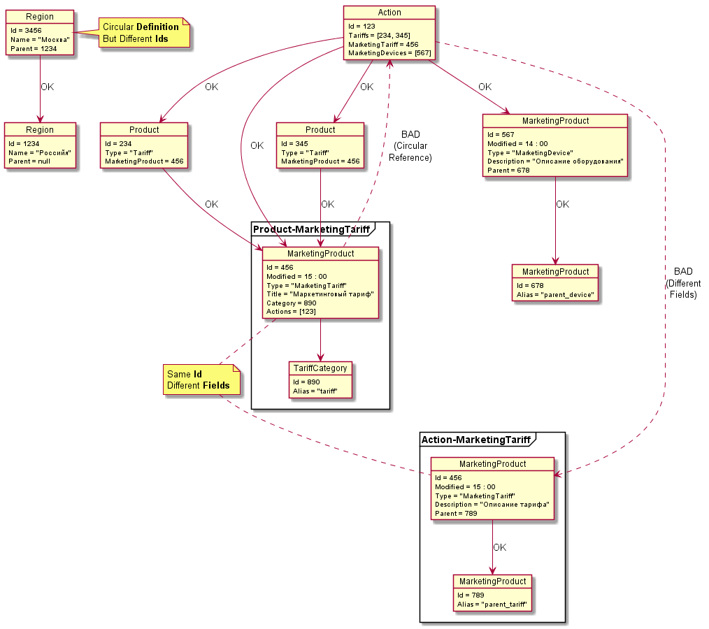

## Архитектура Frontend


### Компоненты

* [React](https://github.com/facebook/react)
* [mobx-react](https://github.com/mobxjs/mobx-react)
* [Blueprint](https://github.com/palantir/blueprint)

### Внедрение зависимостей

* [react-ioc](https://github.com/gnaeus/react-ioc)

### Сервисы

* DataNormalizer: [normalizr](https://github.com/paularmstrong/normalizr)

### Хранилище данных

* DataContext: [mobx-state-tree](https://github.com/mobxjs/mobx-state-tree)

## Преобразования схемы и данных


## Инициализация редактора


## Ограничения редактора

* Данные продукта должны представлять собой направленный ациклический граф.
* Каждая статья (с уникальным Id) доступная для редактирования,
  должна быть представлена Definition-ами c одинаковым набором полей.



Можно иметь циклические ссылки в схеме продукта,
но нельзя иметь цикличекские ссылки в данных продукта.
Например, DPC-ProductDefinition для регионов может выглядеть так:

```js
class Region {
  Id: number;
  Name: string;
  Parent: Region; // циклическая ссылка на схему
}
```

Но данные не должны содержать циклов:

```json
{
  "Id": 123,
  "Name": "Москва",
  "Parent": {
    "Id:": 456,
    "Name": "Россия",
    "Parent": null // циклов нет
  }
}
```

Можно ссылаться из разных мест на одно и то же определение продукта,
но не на разные определения для одинаковой сущности (если она не Readonly):

```js
class Action {
  Id: number;
  Tariffs: Tariff[];
  MarketingTariffs: MarketingTariff[]; // OK
  MarketingTariffs: MarketingTariff2[]; // BAD (Different Fields)
}

class Product {
  Id: number;
  Type: string;
  MarketingProduct: MarketingProduct;
}

class Tariff extends Product {
  Type: Tariff;
  MarketingProduct: MarketingTariff;
}

class MarketingProduct {
  Id: number;
  Type: string;
}

class MarketingTariff extends MarketingProduct {
  Actions: Action[]; // BAD (Circular Reference)
  Category: Category;
}

class MarketingTariff2 extends MarketingProduct {
  Parent: MarketingProduct;
}
```

Единственным исключением является обратная ссылка (BackwardRelation)
на тот же контент, но с флагом : `IsReadOnly`:

```js
class Product {
  Id: number;
  Type: string;
  MarketingProduct: MarketingProduct;
}

class MarketingProduct {
  Id: number;
  Type: string;
  Products: Readonly<Product>[]; // Circular Reference на Readonly контент
}
```

```json
{
  "Id": 1234,
  "Type": "Tariff",
  "MarketingProduct": {
    "Id": 123,
    "Type": "MarketingTariff",
    "Priducts": [
      { "Id": 1234 }, // Circular Reference
      { "Id": 2345, "Type": "Tariff" },
      { "Id": 3456, "Type": "Tariff" }
    ]
  }
}
```
