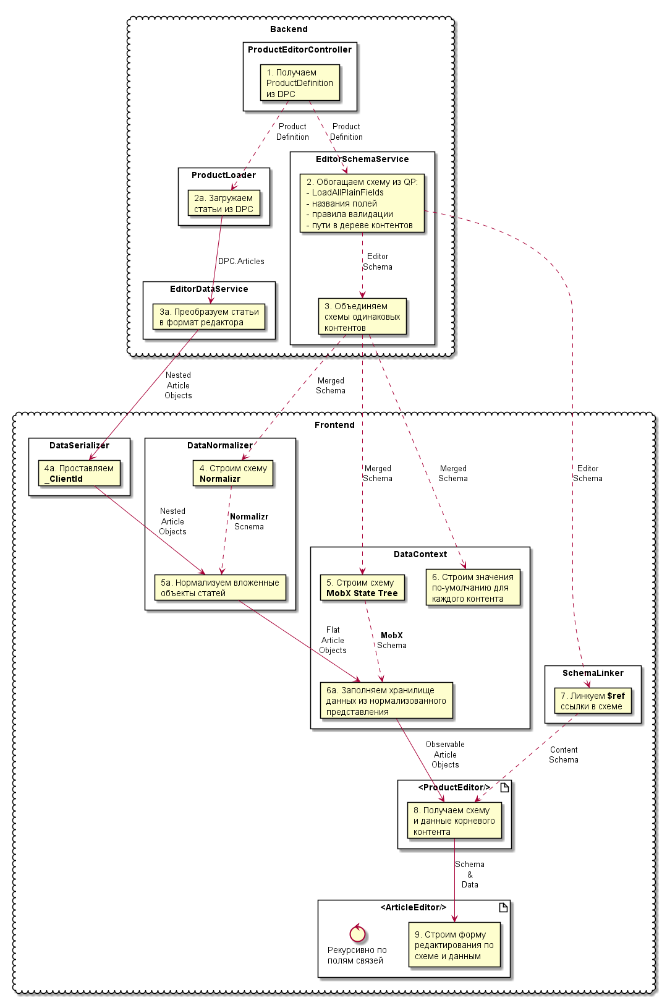
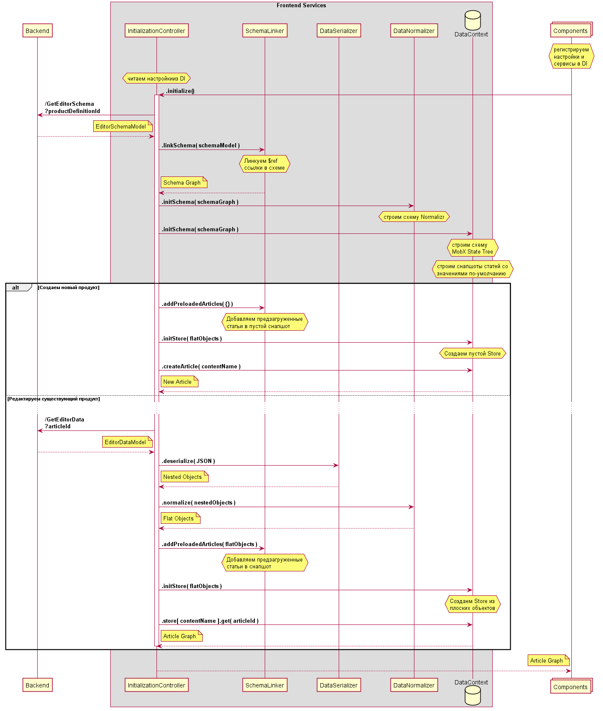

## Архитектура Frontend

### Компоненты

* [React](https://github.com/facebook/react)
* [mobx-react](https://github.com/mobxjs/mobx-react)
* [Blueprint](https://github.com/palantir/blueprint)

### Внедрение зависимостей

* [react-ioc](https://github.com/gnaeus/react-ioc)

### Сервисы

* DataNormalizer: [normalizr](https://github.com/paularmstrong/normalizr)

### Хранилище данных

* DataContext: [mobx-state-tree](https://github.com/mobxjs/mobx-state-tree)

## Преобразования схемы и данных

## Инициализация редактора

