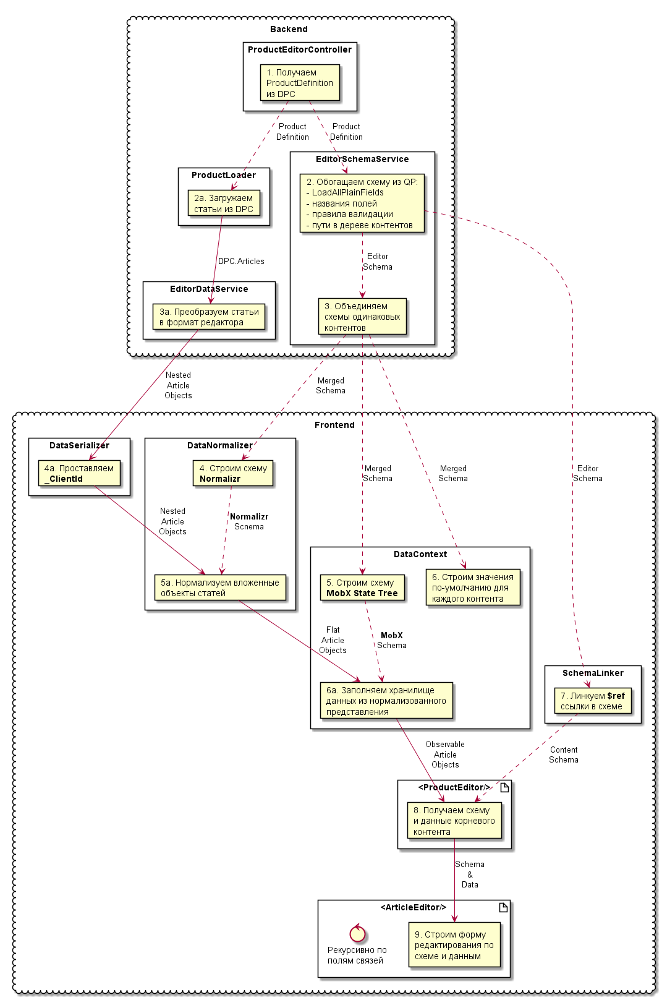
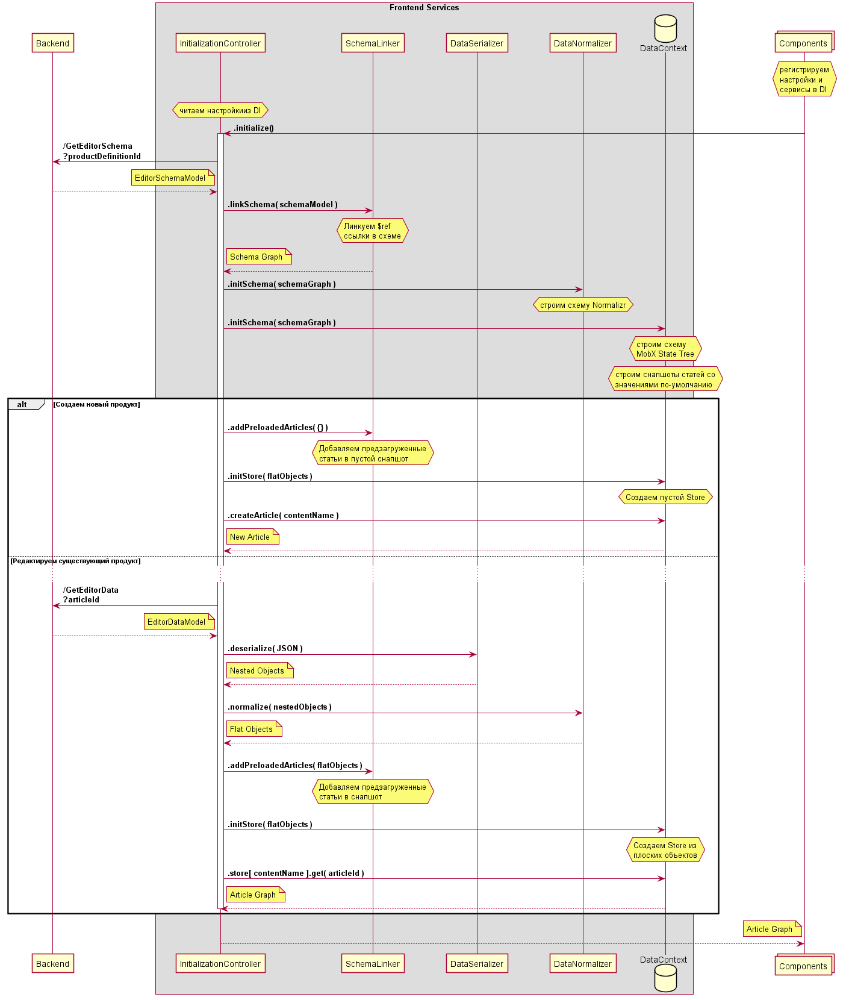

<main style="width: 900px">

## Архитектура Frontend


### Компоненты

* [React](https://github.com/facebook/react)
* [mobx-react](https://github.com/mobxjs/mobx-react)
* [Blueprint](https://github.com/palantir/blueprint)

### Внедрение зависимостей

* [react-ioc](https://github.com/gnaeus/react-ioc)

### Сервисы

* DataNormalizer: [normalizr](https://github.com/paularmstrong/normalizr)

### Хранилище данных

* DataContext: [mobx-state-tree](https://github.com/mobxjs/mobx-state-tree)

## Преобразования схемы и данных



## Инициализация редактора



## Ограничения редактора

Каждая статья (с уникальным Id) доступная для редактирования,
должна быть представлена Definition-ами c одинаковым набором полей.

Если одна и та же статья представлена разными Definition-ами,
то только один Definition контента должен быть доступен для редактирования,
а остальные должны иметь флаг `IsReadOnly`.

```js
class Action {
  Id: number;
  Tariffs: Tariff[];
  MarketingTariffs: MarketingTariff[]; // OK
  MarketingTariffs: MarketingTariff2[]; // BAD (Different Fields)
}

class Product {
  Id: number;
  Type: string;
  MarketingProduct: MarketingProduct;
}

class Tariff extends Product {
  Type: Tariff;
  MarketingProduct: MarketingTariff;
}

class MarketingProduct {
  Id: number;
  Type: string;
}

class MarketingTariff extends MarketingProduct {
  Actions: Action[]; // BAD (Circular Reference)
  Category: Category;
}

class MarketingTariff2 extends MarketingProduct {
  Parent: MarketingProduct;
}
```

Исключением из этого может быть обратная ссылка (BackwardRelation)
на тот же контент, но с флагом : `IsReadOnly`:

```js
class Product {
  Id: number;
  Type: string;
  MarketingProduct: MarketingProduct;
}

class MarketingProduct {
  Id: number;
  Type: string;
  Products: Readonly<Product>[]; // Circular Reference на Readonly контент
}
```

```json
{
  "Id": 1234,
  "Type": "Tariff",
  "MarketingProduct": {
    "Id": 123,
    "Type": "MarketingTariff",
    "Priducts": [
      { "Id": 1234 }, // Circular Reference
      { "Id": 2345, "Type": "Tariff" },
      { "Id": 3456, "Type": "Tariff" }
    ]
  }
}
```

</main>
